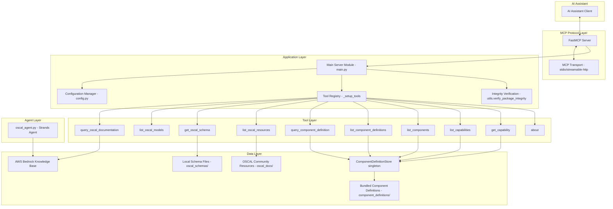

# Design Document: OSCAL MCP Server

## Overview

The OSCAL MCP Server is a Model Context Protocol (MCP) server that provides AI assistants with specialized tools for working with NIST's Open Security Controls Assessment Language (OSCAL). The server acts as a bridge between AI assistants and OSCAL resources, enabling intelligent querying of OSCAL documentation, schema retrieval, model information access, community resource listing, and pre-loaded Component Definition querying.

The system is built using Python with the FastMCP framework and integrates with AWS Bedrock Knowledge Base for documentation queries. It leverages the **compliance-trestle** library for OSCAL document parsing, validation, and serialization, providing type-safe Pydantic models for all OSCAL document types. A **Strands Agent** module provides a conversational OSCAL expert interface powered by Amazon Bedrock.

The server provides these primary tools:
- `query_oscal_documentation` — query Bedrock Knowledge Base (conditionally registered)
- `list_oscal_models` — list OSCAL model types with metadata
- `get_oscal_schema` — retrieve JSON/XSD schemas
- `list_oscal_resources` — return curated community resources
- `query_component_definition` — query pre-loaded components by UUID, title, or type
- `list_component_definitions` — list loaded Component Definitions with summaries
- `list_components` — list loaded Components with parent info
- `list_capabilities` — list loaded Capabilities with parent info
- `get_capability` — retrieve a specific Capability by UUID
- `about` — return server metadata (version, keywords, OSCAL version)

## Architecture

The system follows a layered architecture with clear separation of concerns:



### Key Architectural Principles

1. **Protocol Abstraction**: MCP protocol handling is abstracted through FastMCP framework
2. **Tool-Based Design**: Functionality is exposed as discrete, composable tools registered in `_setup_tools()`
3. **Configuration-Driven**: Behavior is controlled through environment variables (via dotenv) and CLI arguments
4. **Singleton Store**: `ComponentDefinitionStore` is a module-level singleton (`_store`) that loads data at import time
5. **Local-First Resources**: Schemas, docs, and component definitions are stored locally; remote URIs require explicit opt-in
6. **Type-Safe OSCAL Handling**: Uses compliance-trestle's Pydantic models for automatic validation and type safety
7. **Integrity Verification**: SHA-256 hash verification of bundled content at startup before any tools are registered

## Components and Interfaces

### Main Server Component (`main.py`)

**Responsibilities:**
- Initialize and configure the FastMCP server instance (module-level `mcp` global)
- Parse CLI arguments (`--aws-profile`, `--bedrock-model-id`, `--knowledge-base-id`, `--log-level`, `--transport`)
- Update config from CLI args via `config.update_from_args()`
- Configure logging for all components
- Validate transport configuration via `config.validate_transport()`
- Verify integrity of bundled content directories (oscal_schemas, oscal_docs, component_definitions)
- Register tools via `_setup_tools()` — conditionally registers `query_oscal_documentation` based on `config.knowledge_base_id`
- Define the `about` tool inline using `@mcp.tool` decorator
- Run the MCP server with configured transport

**Key Interfaces:**
```python
def main() -> None:
    """Entry point: parse args, configure, verify integrity, register tools, run server."""

def _setup_tools() -> None:
    """Import and register all tool functions with the MCP server.
    Conditionally registers query_oscal_documentation if knowledge_base_id is set.
    Defines the about tool inline."""

mcp: FastMCP  # Module-level server instance

@mcp.tool(name="about")
def about() -> dict:
    """Returns {"version": ..., "keywords": ..., "oscal-version": "1.2.0"}
    from installed package metadata."""
```

### Configuration Manager (`config.py`)

**Responsibilities:**
- Load configuration from environment variables via `dotenv`
- Provide sensible defaults for all settings
- Support runtime updates from CLI arguments
- Validate transport configuration

**Key Interfaces:**
```python
class Config:
    bedrock_model_id: str          # default: "us.anthropic.claude-sonnet-4-20250514-v1:0"
    knowledge_base_id: str         # default: "" (empty disables doc query tool)
    aws_profile: str | None        # from AWS_PROFILE
    aws_region: str | None         # from AWS_REGION
    log_level: str                 # default: "INFO"
    server_name: str               # default: "OSCAL" (from OSCAL_MCP_SERVER_NAME)
    transport: str                 # default: "stdio" (from OSCAL_MCP_TRANSPORT)
    allow_remote_uris: bool        # default: False (from OSCAL_ALLOW_REMOTE_URIS)
    request_timeout: int           # default: 30 (from OSCAL_REQUEST_TIMEOUT)
    max_uri_depth: int             # default: 3 (from OSCAL_MAX_URI_DEPTH)
    component_definitions_dir: str # default: "component_definitions" (from OSCAL_COMPONENT_DEFINITIONS_DIR)

    def update_from_args(self, bedrock_model_id=None, knowledge_base_id=None,
                         log_level=None, transport=None) -> None
    def validate_transport(self) -> None  # raises ValueError for invalid transport

config = Config()  # Module-level singleton instance
```

### ComponentDefinitionStore (`query_component_definition.py`)

**Responsibilities:**
- Load, parse, and index OSCAL Component Definitions from local directories and external URIs
- Maintain multiple index dictionaries for efficient lookup by path, UUID, title
- Index child Components and Capabilities with parent relationship tracking
- Support querying by UUID, title, type, and "all"
- Integrate capability lookup into the query flow (capability-first check before component search)
- Track loading statistics

**Key Interfaces:**
```python
class ComponentDefinitionStore:
    # Index dictionaries
    _cdefs_by_path: dict[str, ComponentDefinition]
    _cdefs_by_uuid: dict[str, ComponentDefinition]
    _cdefs_by_title: dict[str, ComponentDefinition]       # case-insensitive keys
    _components_by_uuid: dict[str, DefinedComponent]
    _components_by_title: dict[str, DefinedComponent]     # case-insensitive keys
    _components_to_cdef_by_uuid: dict[str, str]           # component UUID → cdef UUID
    _capabilities_by_uuid: dict[str, Capability]
    _capabilities_by_name: dict[str, Capability]          # case-insensitive keys
    _capabilities_to_cdef_by_uuid: dict[str, str]         # capability UUID → cdef UUID
    _stats: dict[str, int]

    def _reset(self) -> None
    def load_from_directory(self, directory_path: Path | None = None) -> dict[str, ComponentDefinition]
    def load_external_component_definition(self, source: str, ctx: Context) -> None
    def query(self, ctx, component_definition_filter=None, query_type="all",
              query_value=None, return_format="raw") -> dict[str, Any]
    def list_component_definitions(self, ctx: Context) -> list[dict]
    def list_components(self, ctx: Context) -> list[dict]
    def list_capabilities(self, ctx: Context) -> list[dict]

    # Static helpers
    @staticmethod
    def find_component_by_prop_value(components, value) -> DefinedComponent | None
    @staticmethod
    def filter_components_by_type(components, component_type) -> list[DefinedComponent]

    # Private helpers
    def _process_zip_files(self, directory_path: Path) -> None
    def _handle_zip_file(self, zf: Path) -> None
    def _process_json_files(self, directory_path: Path) -> None
    def _index_components(self, cdef: ComponentDefinition, path: str) -> None
    def _resolve_comp_defs(self, filter_value, ctx) -> list[ComponentDefinition]
    @staticmethod
    def _build_filtered_indexes(comp_defs) -> tuple[dict, dict]
    def _select_components(self, query_type, query_value, by_uuid, by_title, ctx) -> list[DefinedComponent]

_store = ComponentDefinitionStore()  # Module-level singleton
_store.load_from_directory()         # Called at module import time
```

### MCP Tool Wrappers (`query_component_definition.py` module-level functions)

Thin wrapper functions decorated with `@tool` that delegate to the `_store` singleton:

```python
@tool
def query_component_definition(ctx, component_definition_filter=None,
    query_type="all", query_value=None, return_format="raw") -> dict
    # → _store.query(...)

@tool
def list_component_definitions(ctx) -> list[dict]
    # → _store.list_component_definitions(ctx)

@tool
def list_components(ctx) -> list[dict]
    # → _store.list_components(ctx)

@tool
def list_capabilities(ctx) -> list[dict]
    # → _store.list_capabilities(ctx)

@tool
def get_capability(ctx, uuid: str) -> dict | None
    # → direct dict lookup on _store._capabilities_by_uuid
```

### Query Documentation Tool (`query_documentation.py`)

**Responsibilities:**
- Interface with AWS Bedrock Knowledge Base via boto3
- Handle AWS authentication using configured profile
- Provide `query_local()` fallback stub when KB is unavailable

```python
@tool
def query_oscal_documentation(query: str, ctx: Context) -> Any
def query_kb(query: str, ctx: Context) -> Any
def query_local(query: str, ctx: Context) -> Any  # placeholder, returns error
```

### List Models Tool (`list_models.py`)

```python
@tool
def list_oscal_models() -> dict
    # Returns dict keyed by OSCALModelType with description, layer, formalName, shortName, status
```

### Get Schema Tool (`get_schema.py`)

```python
@tool
def get_oscal_schema(ctx: Context, model_name: str = "complete", schema_type: str = "json") -> str
def open_schema_file(file_name: str) -> Any
```

### List OSCAL Resources Tool (`list_oscal_resources.py`)

```python
@tool
def list_oscal_resources(ctx: Context) -> str
def read_resources_file() -> str  # reads oscal_docs/awesome-oscal.md with UTF-8, latin-1 fallback
```

### Utilities Module (`utils.py`)

```python
class OSCALModelType(StrEnum):
    CATALOG, PROFILE, COMPONENT_DEFINITION, SYSTEM_SECURITY_PLAN,
    ASSESSMENT_PLAN, ASSESSMENT_RESULTS, PLAN_OF_ACTION_AND_MILESTONES, MAPPING

schema_names: dict[str, str]  # maps OSCALModelType → schema file base name

def try_notify_client_error(msg: str, ctx: Context) -> None
def safe_log_mcp(msg: str, ctx: Context, level: str) -> None
def verify_package_integrity(directory: Path) -> None
    # SHA-256 verification against hashes.json manifest; raises RuntimeError on mismatch
```

### OSCAL Agent (`oscal_agent.py`)

```python
agent: Agent  # Global variable

def create_oscal_agent() -> Agent:
    # Creates Strands Agent with BedrockModel using config.aws_profile/aws_region
    # Sets system prompt describing OSCAL expertise
    # Enables load_tools_from_directory=True
```

## Data Models

### Configuration Data Model

```python
class Config:
    bedrock_model_id: str = "us.anthropic.claude-sonnet-4-20250514-v1:0"
    knowledge_base_id: str = ""
    aws_profile: str | None = None
    aws_region: str | None = None
    log_level: str = "INFO"
    server_name: str = "OSCAL"
    transport: str = "stdio"
    allow_remote_uris: bool = False
    request_timeout: int = 30
    max_uri_depth: int = 3
    component_definitions_dir: str = "component_definitions"
```

### OSCAL Model Information (from `list_models.py`)

Each model entry contains:
```python
{
    "description": str,
    "layer": Literal["Control", "Implementation", "Assessment"],
    "formalName": str,
    "shortName": str,
    "status": Literal["GA", "PROTOTYPE"],
}
```

### ComponentDefinitionStore Index Structure

The store maintains these indexes populated at startup:

| Index | Key | Value | Case-Sensitive |
|-------|-----|-------|----------------|
| `_cdefs_by_path` | file path (str) | `ComponentDefinition` | Yes |
| `_cdefs_by_uuid` | UUID (str) | `ComponentDefinition` | Yes |
| `_cdefs_by_title` | title (str) | `ComponentDefinition` | No (lowercased) |
| `_components_by_uuid` | UUID (str) | `DefinedComponent` | Yes |
| `_components_by_title` | title (str) | `DefinedComponent` | No (lowercased) |
| `_components_to_cdef_by_uuid` | component UUID | parent cdef UUID | Yes |
| `_capabilities_by_uuid` | UUID (str) | `Capability` | Yes |
| `_capabilities_by_name` | name (str) | `Capability` | No (lowercased) |
| `_capabilities_to_cdef_by_uuid` | capability UUID | parent cdef UUID | Yes |

### Stats Tracking

```python
_stats = {
    "loaded_files": int,
    "processed_zip_files": int,
    "zip_file_contents": int,
    "processed_json_files": int,
    "component_definitions_indexed": int,
    "components_indexed": int,
    "processed_external_files": int,
    "capabilities_indexed": int,
}
```

### Tool Response Models

```python
# Component Definition Query Response (from _store.query())
{
    "components": list[dict],           # serialized DefinedComponent dicts (exclude_none=True)
    "total_count": int,
    "query_type": str,
    "component_definitions_searched": int,
    "filtered_by": str | None,
}

# Capability Query Response (when query matches a capability)
{
    "capability": dict,                 # cap.oscal_dict()
    "component_count": int,
    "query_type": str,
    "component_definitions_searched": int,
    "filtered_by": str | None,
}

# List Component Definitions Response
[{
    "uuid": str,
    "title": str,
    "componentCount": int,
    "importedComponentDefinitionsCount": int,
    "sizeInBytes": int,
}]

# List Components Response
[{
    "uuid": str,
    "title": str,
    "parentComponentDefinitionTitle": str,
    "parentComponentDefinitionUuid": str,
    "sizeInBytes": int,
}]

# List Capabilities Response
[{
    "uuid": str,
    "name": str,
    "parentComponentDefinitionTitle": str,
    "parentComponentDefinitionUuid": str,
    "sizeInBytes": int,
}]

# About Response
{
    "version": str,
    "keywords": str,
    "oscal-version": "1.2.0",
}
```

### OSCAL Types (from compliance-trestle)

The system uses these Pydantic models from `trestle.oscal.component`:
- `ComponentDefinition` — top-level document with uuid, metadata, components, capabilities, import_component_definitions, back_matter
- `DefinedComponent` — a component with uuid, type, title, description, purpose, props, links, control_implementations
- `Capability` — a capability grouping with uuid, name, description, incorporates_components

Key trestle methods used:
- `ComponentDefinition.oscal_read(path)` — load from JSON file
- `ComponentDefinition.parse_obj(data)` — parse from dict
- `.dict(exclude_none=True)` — serialize to dict
- `.oscal_serialize_json_bytes()` — serialize to JSON bytes (used for size calculation)
- `.oscal_dict()` — serialize to OSCAL-formatted dict (used for capability responses)

### Integrity Verification Data Model

```python
# hashes.json format in each verified directory
{
    "commit": str,          # git commit hash
    "file_hashes": {
        "filename": str,    # SHA-256 hex digest
    }
}
```


## Correctness Properties

*A property is a characteristic or behavior that should hold true across all valid executions of a system — essentially, a formal statement about what the system should do. Properties serve as the bridge between human-readable specifications and machine-verifiable correctness guarantees.*

### Property 1: Documentation Query Passthrough

*For any* documentation query string, when the Bedrock Knowledge Base returns a response, the server should return that exact response without modification.

**Validates: Requirements 1.1, 1.2**

### Property 2: AWS Profile Session Creation

*For any* configured AWS profile string, the server should create a boto3 Session using that specific profile name for Bedrock Knowledge Base queries.

**Validates: Requirements 1.5**

### Property 3: Model Metadata Validity

*For any* model returned by `list_oscal_models`, the response should include non-empty `description`, `layer`, and `status` fields, where `layer` is one of "Control", "Implementation", or "Assessment" and `status` is one of "GA" or "PROTOTYPE".

**Validates: Requirements 2.2, 2.4, 2.5**

### Property 4: Schema Format Consistency

*For any* valid model name and schema type combination, when `schema_type` is "json" the returned string should be parseable as valid JSON, and when `schema_type` is "xsd" the returned string should contain XSD content.

**Validates: Requirements 3.1, 3.2, 3.3, 8.6**

### Property 5: Invalid Schema Input Error Handling

*For any* string that is not a valid OSCAL model name, `get_oscal_schema` should raise a `ValueError` referencing the `list_models` tool. *For any* string that is not "json" or "xsd" as `schema_type`, it should raise a `ValueError` specifying valid options.

**Validates: Requirements 3.5, 3.6**

### Property 6: Schema File System Consistency

*For any* supported OSCAL model type, both a JSON schema file and an XSD schema file should exist in the `oscal_schemas` directory following the naming convention `oscal_{model}_schema.{type}`.

**Validates: Requirements 8.2, 8.3**

### Property 7: Configuration Override Precedence

*For any* configuration parameter that can be set via both environment variable and CLI argument, calling `update_from_args()` with a non-None value should override the environment variable value.

**Validates: Requirements 4.1, 4.6**

### Property 8: Invalid Transport Rejection

*For any* string that is not "stdio" or "streamable-http", `config.validate_transport()` should raise a `ValueError` listing the valid transport options.

**Validates: Requirements 7.5**

### Property 9: Log Level Configuration

*For any* valid log level (DEBUG, INFO, WARNING, ERROR), setting that level should be accepted and applied to logging configuration without error.

**Validates: Requirements 6.1, 6.6**

### Property 10: Error Logging and Client Notification

*For any* error condition during tool execution, the server should both log the error and use the MCP context (`try_notify_client_error` / `safe_log_mcp`) to report the error to the client.

**Validates: Requirements 1.6, 6.2, 6.5, 6.7**

### Property 11: Invalid Tool Parameter Rejection

*For any* tool invocation with invalid parameters (e.g., `query_type` of "by_uuid" without a `query_value`), the server should raise a `ValueError` with a clear, descriptive error message.

**Validates: Requirements 6.7, 11.4**

### Property 12: Component Definition Indexing Completeness

*For any* valid Component Definition loaded into the store, it should be retrievable by its file path, UUID, and title (case-insensitive). Each of its child Components should be retrievable by UUID and title (case-insensitive). Each of its child Capabilities should be retrievable by UUID and name (case-insensitive).

**Validates: Requirements 10.2, 10.3, 10.4**

### Property 13: Parent Relationship Tracking

*For any* indexed Component, `_components_to_cdef_by_uuid` should map its UUID to the correct parent Component Definition UUID. *For any* indexed Capability, `_capabilities_to_cdef_by_uuid` should map its UUID to the correct parent Component Definition UUID.

**Validates: Requirements 10.5, 10.6**

### Property 14: Directory Reset on Explicit Path

*For any* store with previously loaded data, calling `load_from_directory()` with an explicit `directory_path` argument should clear all previously indexed data before loading from the new directory.

**Validates: Requirements 10.11**

### Property 15: Loading Statistics Accuracy

*For any* loading operation, the `_stats` dictionary should accurately reflect the counts of loaded files, processed zip files, zip file contents, processed JSON files, indexed component definitions, indexed components, processed external files, and indexed capabilities.

**Validates: Requirements 10.12**

### Property 16: Component Definition Filter Scoping

*For any* valid Component Definition UUID or title used as `component_definition_filter`, the query should only search components within that specific Component Definition.

**Validates: Requirements 11.2**

### Property 17: Capability Query Integration

*For any* query where `query_value` matches a Capability (by name for `by_title`, by UUID for `by_uuid`), the query should return the matching Capability. When a `component_definition_filter` is also provided, the Capability should only be returned if it belongs to a matching Component Definition.

**Validates: Requirements 11.5, 11.6, 11.7**

### Property 18: Title Fallback to Prop Value Search

*For any* `by_title` query where no exact Component title match is found, the query should search for an exact match in the `value` field of any `props` defined on Components in scope.

**Validates: Requirements 11.8**

### Property 19: Component Type Filtering Accuracy

*For any* `by_type` query with a given type value, all returned components should have a `type` field exactly matching the query value.

**Validates: Requirements 11.9**

### Property 20: Query Response Structure

*For any* component query response, it should contain the keys `components`, `total_count`, `query_type`, `component_definitions_searched`, and `filtered_by`.

**Validates: Requirements 11.10**

### Property 21: List Component Definitions Completeness

*For any* set of loaded Component Definitions, `list_component_definitions` should return one entry per loaded cdef, each containing `uuid`, `title`, `componentCount`, `importedComponentDefinitionsCount`, and `sizeInBytes`.

**Validates: Requirements 12.1, 12.2**

### Property 22: List Components Completeness

*For any* set of loaded Components, `list_components` should return one entry per loaded component, each containing `uuid`, `title`, `parentComponentDefinitionTitle`, `parentComponentDefinitionUuid`, and `sizeInBytes`.

**Validates: Requirements 13.1, 13.2**

### Property 23: List Capabilities Completeness

*For any* set of loaded Capabilities, `list_capabilities` should return one entry per loaded capability, each containing `uuid`, `name`, `parentComponentDefinitionTitle`, `parentComponentDefinitionUuid`, and `sizeInBytes`.

**Validates: Requirements 14.1, 14.2**

### Property 24: Get Capability Correctness

*For any* UUID, `get_capability` should return the full Capability dict if the UUID exists in the store, or `None` if it does not.

**Validates: Requirements 15.1, 15.2**

### Property 25: External URI Validation

*For any* local directory path provided to `load_external_component_definition`, the store should raise a `ValueError`. *For any* remote URI when `allow_remote_uris` is `False`, the store should raise a `ValueError` indicating remote loading is not enabled.

**Validates: Requirements 16.2, 16.3**

### Property 26: Remote Component Definition Loading

*For any* valid remote URI when `allow_remote_uris` is `True`, the store should fetch, parse via `ComponentDefinition.parse_obj()`, and index the Component Definition.

**Validates: Requirements 16.4**

### Property 27: Integrity Verification

*For any* file in a verified directory whose computed SHA-256 hash does not match the expected hash in `hashes.json`, `verify_package_integrity` should raise a `RuntimeError`. *For any* file listed in the manifest that is missing from the directory, it should raise a `RuntimeError`. *For any* file present in the directory but not listed in the manifest, it should raise a `RuntimeError`.

**Validates: Requirements 18.5, 18.6, 18.7**

### Property 28: OSCAL Resources Content Preservation

*For any* call to `list_oscal_resources`, the returned string should exactly match the contents of the `awesome-oscal.md` file, preserving all markdown formatting.

**Validates: Requirements 9.1, 9.3, 9.6**

### Property 29: Agent Profile and Region Configuration

*For any* configured AWS profile and region, `create_oscal_agent` should create a boto3 Session using those values and pass it to the BedrockModel.

**Validates: Requirements 19.2**

## Error Handling

The system implements comprehensive error handling at multiple levels:

### Tool-Level Error Handling
- **Input Validation**: All tools validate parameters before execution. `get_oscal_schema` validates model_name against `OSCALModelType` and schema_type against `["json", "xsd"]`. `query()` validates that `query_value` is provided for non-"all" query types.
- **AWS Service Errors**: `query_kb()` catches all exceptions from boto3 calls, logs them, notifies the client via `ctx.error()`, and re-raises.
- **File System Errors**: `open_schema_file()` and `read_resources_file()` catch `FileNotFoundError`, `UnicodeDecodeError`, and `OSError` with descriptive messages. `read_resources_file()` includes a latin-1 encoding fallback.
- **Context Reporting**: All error paths use `try_notify_client_error()` / `safe_log_mcp()` to report errors through the MCP context to the client. These helpers handle both async and sync contexts.
- **Component Definition Parsing**: `_process_json_files()` catches exceptions per-file and continues loading remaining files. `load_external_component_definition()` catches `requests.Timeout`, `requests.RequestException`, `json.JSONDecodeError`, and general exceptions, wrapping each in `ValueError`.
- **Empty Store**: `query()` raises `ValueError` when no cdefs are loaded. `list_component_definitions()` and `list_components()` raise `RuntimeError`. `list_capabilities()` returns an empty list without error.

### Configuration Error Handling
- **Missing Configuration**: `Config.__init__()` provides defaults for all settings via `os.getenv()` with fallback values.
- **Transport Validation**: `validate_transport()` raises `ValueError` for invalid transport types before server startup.
- **Dotenv Loading**: `load_dotenv()` is called in `Config.__init__()` to load `.env` files.

### Startup Error Handling
- **Integrity Verification**: `verify_package_integrity()` raises `RuntimeError` for hash mismatches, missing files, or orphaned files. `main()` catches `RuntimeError` and `KeyError`, logs a tamper warning, and exits with code 2.
- **Transport Validation**: `main()` catches `ValueError` from `validate_transport()` and exits with code 1.
- **Logging Configuration**: Invalid log levels are caught and warned about without crashing.

### Logging Strategy
- **Configurable Levels**: Support for DEBUG, INFO, WARNING, and ERROR via `LOG_LEVEL` env var or `--log-level` CLI arg.
- **Component-Specific Loggers**: Each module creates its own logger via `logging.getLogger(__name__)`.
- **Library Loggers**: `main()` configures log levels for `strands`, `mcp.*`, `trestle.*`, and package loggers.

## Testing Strategy

The testing strategy employs both unit testing and property-based testing for comprehensive coverage.

### Unit Testing Approach
- **Component Isolation**: Test individual tools in isolation with mocked MCP Context, boto3 sessions, and file system
- **Configuration Testing**: Verify `Config` loading from env vars, CLI override precedence, and transport validation
- **Error Condition Testing**: Test specific error scenarios — empty store, missing files, invalid inputs, network failures
- **Integration Points**: Test tool registration in `_setup_tools()`, conditional registration of `query_oscal_documentation`
- **AWS Service Mocking**: Mock boto3 `bedrock-agent-runtime` client for documentation query tests
- **Integrity Verification**: Test `verify_package_integrity()` with tampered files, missing files, orphaned files

### Property-Based Testing Configuration
The system uses **pytest** with **Hypothesis** for property-based testing. Each property test runs a minimum of 100 iterations.

**Property Test Implementation Requirements:**
- Each correctness property must be implemented as a single property-based test
- Tests must be tagged with: **Feature: oscal-mcp-server, Property {number}: {property_text}**
- Property tests should generate realistic test data using Hypothesis strategies
- Mock external dependencies (AWS Bedrock, file system, HTTP) to focus on system logic
- Use `@given` decorator with appropriate strategies for input generation

### Test Data Generation Strategy
- **Query Strings**: `st.text()` for documentation queries, including empty and unicode strings
- **Model Names**: `st.sampled_from(OSCALModelType)` for valid names, `st.text()` for invalid
- **Configuration Values**: `st.fixed_dictionaries()` for env var combinations
- **Schema Types**: `st.sampled_from(["json", "xsd"])` for valid, `st.text()` for invalid
- **Component Definitions**: Generate valid `ComponentDefinition` dicts with random UUIDs, titles, components, and capabilities using Hypothesis strategies
- **UUIDs**: `st.uuids()` for generating random UUIDs
- **Component Queries**: Generate query parameters with `st.sampled_from(["all", "by_uuid", "by_title", "by_type"])` and corresponding values
- **File Hashes**: Generate directory structures with `hashes.json` manifests for integrity testing
- **URIs**: Generate local file paths and remote URLs for external loading tests

### Integration Testing
- **End-to-End Tool Testing**: Test complete tool execution paths through the MCP framework
- **Store Loading**: Test `load_from_directory()` with real bundled component definitions
- **Query Flow**: Test the full query path including capability-first check, cdef filtering, and prop fallback
- **Startup Sequence**: Test the `main()` startup sequence including integrity verification, tool registration, and transport configuration
